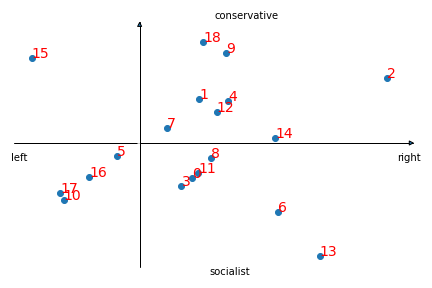
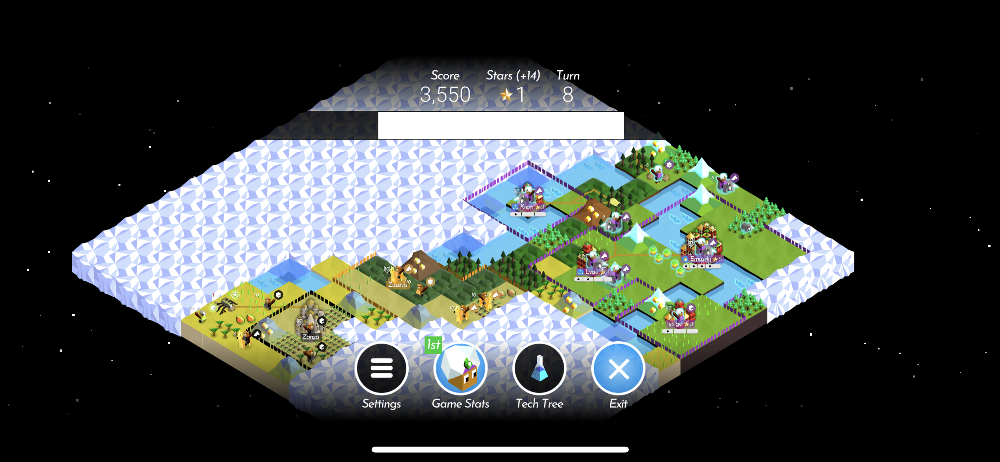
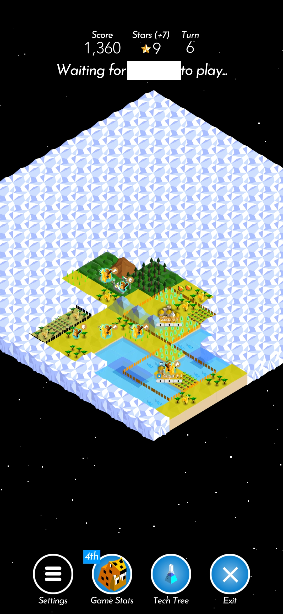
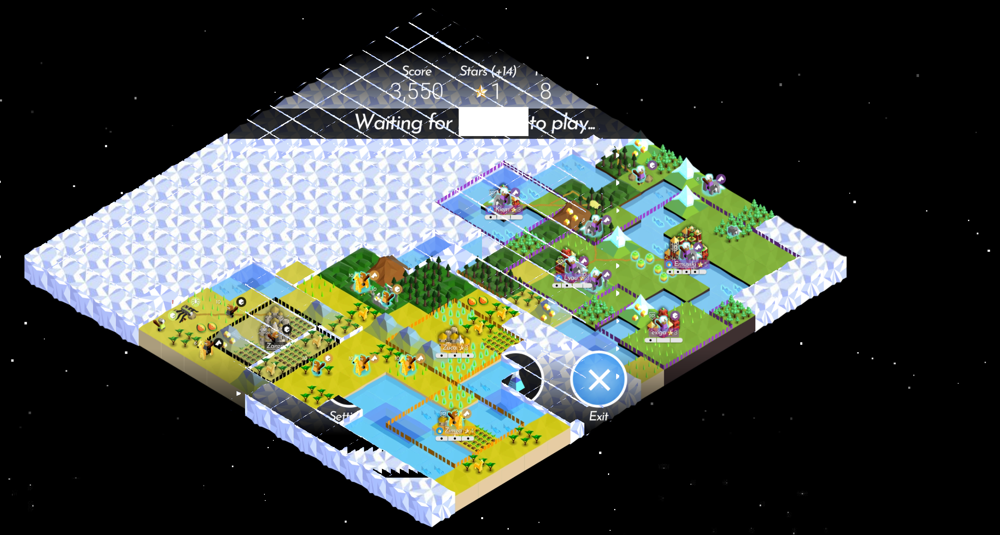

# My home to ideas

Hi, you have found the repository where I link what I have been doing and decided to share.
By the time I will have shared all the prototypes I have started, it will already look like a project graveyard.
No need to add ideas that have never seen day of light.

## media analyser

Active in 2021

Sources: [Github](https://github.com/ReadrAI/MediAnalyserPOC)

Grab news from all points of view and understand where you stand on the information landscape in a glimpse. If you are a sucker for world news, technology, or the latest celebrity scandal but want to know if the truth compares to what your neighbour or weird uncle reads daily, give it a try.

The app processes emails with your source link, and provides you with a list of articles plotted on two dimensions relevant to the topic. A machine learning model based on word embeddings has been built to find nearest neighbours to article summaries.

The challenges were to collect information usable in model training, as well as labelling the two dimensions to plot it on. Indeed, diverse information from multiple contradictory sources is required for the current day, requiring some data crawling. The dimension

This project is clearly lacking a good UI/UX, yet it was nice to get my news from that app for a few weeks. I still regret dropping that project. Throwback to when I fully understood TF-IDF :’)

Python, sklearn, flask, google cloud

## AI book editor

Active in 2024

Are you an author looking for complete and immediate feedback on the book you're righting? Look no further and understand if your main character correctly pursues the main goal throughout the novel and how to balance it with how your secondary characters

This summary is rather short as it may be in use as we speak.

The technology may be improved by using a local model, ensuring privacy of books and avoiding author's IP leak, and better processing and visualisation. An agentic version allowing continuous analaysis and inline feedback may come one day.

OpenAI GPT4.0, python

## polytopia map patcher

Active in 2022 to 2023

Sources: [GitHub](https://github.com/JeanHaiz/Polytopia)

As a polytopia pro player, your team is in need of quick overview of the situation over the whole map, but the fog prevents you from knowing how far you are. 1 cloud, 2 clouds, a river maybe? And of course your phone screen is to narrow to see it all, but you need the overview!! Create a patchwork of maps to get the most up to date and global view directly in discourse in your team server, on your game channel.

Inputs:

Output:

The challenge was to host the few docker containers on a laptop in my office and not run out of memory. Some images where also hard to parse due to the varriety of map tile colours. Finding reliable image processing techniques required lots of creativity.

Further enhancements into score counting with a solver were made, and might have been used in league games to figure out how the starting moves and positions of the opponents in the fog. Who knows? This for sure would have required score sheet recognition as well.

python, docker, discord api, rabbitmq, ocr,

## Forestry app

Active in 2023, 2024 and 2025

Your municipal forestry department is planning its yearly tree cut, from hammering to measurement, and seeks to commercialise it. Move to the digital era and capture your work on the ground with or without network and retrieve it on your desktop once you're back to the office for the sale.

This app is productive and customers are relying on it to get their daily job done.

javascript, node, react, react-native, sequelize
